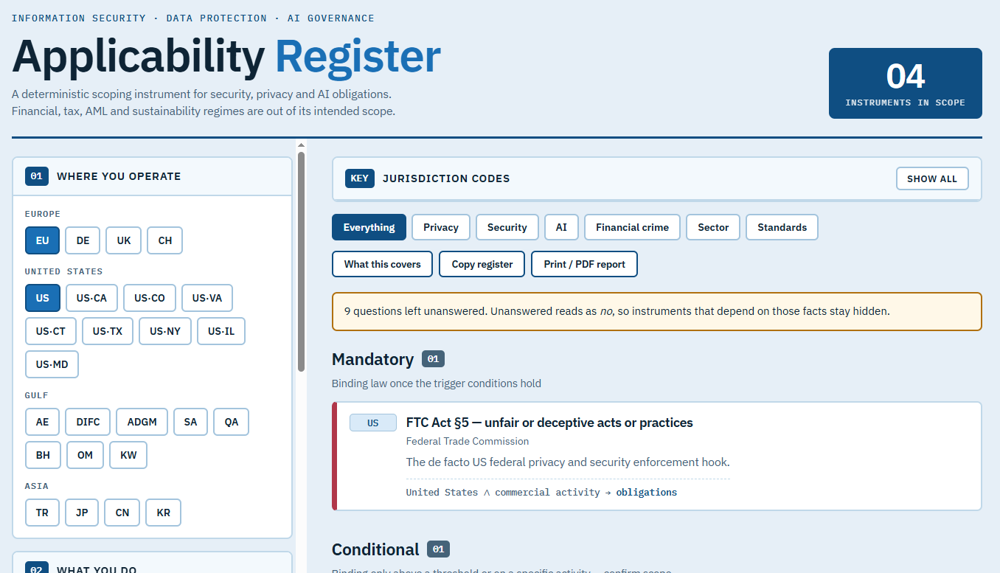

# Applicability Register

A deterministic regulatory scoping tool for people who don't yet know which rules apply to them.

**[Open the live app →](https://umutkarakurt.github.io/applicability-register/)** · [Source](https://github.com/umutkarakurt/applicability-register)

Answer a short questionnaire — where you operate, what you do, what data you touch, your role in AI - and it returns the information security, data protection and AI governance instruments that apply, grouped by how binding they are, each with its obligations, issuing authority and a link to the primary source.

It runs entirely in your browser. One HTML file, no install, no build step, no server, no account. Nothing you type is transmitted anywhere.

---

## Scope, and what is deliberately outside it

The register covers **information security, cybersecurity, data protection and AI governance**.

It does **not** systematically cover financial services and prudential regulation, tax, AML and sanctions, employment, consumer protection, competition, or sustainability reporting. A handful of instruments from those domains appear — SOX, FINRA, DORA, PSD2, BaFin, SAMA - but only because they carry a security, recordkeeping or ICT-risk obligation. Those domains were never swept.

**A silence in an out-of-scope domain is not a negative finding.** The register was not looking.

---

## How it works

There is no language model in the running application. Every result comes from a hardcoded rules engine: each instrument carries an explicit predicate, and it fires or it doesn't.

That design was chosen on purpose. A regulatory mapping tool lives or dies on citation accuracy, and a model generating the applicable-law list at runtime will occasionally invent a plausible instrument or a plausible article number. A fixed decision matrix is narrower, but every line of it can be defended.

Three properties follow from that choice:

**Every result shows its derivation.** Each card carries the trigger trace that produced it — `Germany ∧ personal data → obligations`. You can see why something surfaced, and challenge it.

**Unanswered reads as no, and the tool says so.** A blank question silently suppresses instruments, so the app counts unanswered questions and warns you rather than guessing.

**You can see what it cannot know.** The *What this covers* button lists all 102 instruments in the catalogue, grouped by jurisdiction. An instrument that is not on that list will never appear in a result, whatever you answer. For a tool whose main failure mode is silent omission, that list is the most important control in the interface.

---

## Coverage

102 instruments across 24 jurisdiction codes.

| Region | Codes |
|---|---|
| Europe | EU/EEA, Germany, United Kingdom, Switzerland |
| United States | Federal, CA, CO, VA, CT, TX, NY, IL, MD |
| Gulf | UAE onshore, DIFC, ADGM, Saudi Arabia, Qatar, Bahrain, Oman, Kuwait |
| Asia | Türkiye, Japan, China, South Korea |
| Cross-border | Standards and frameworks that attach to an activity rather than a territory |

EU member states inherit the EU acquis: selecting Germany returns the GDPR, the AI Act and DORA alongside the BDSG, the TDDDG and the works council rules.

Results are tiered — **Mandatory**, **Conditional**, **Frameworks and standards**, **Guidance** — so that ISO 27001 and NIST CSF appear as the evidence layer beneath the obligations rather than as peers of them.

---

## Using it

**In a browser:** open the [live app](https://umutkarakurt.github.io/applicability-register/).

**Offline:** download [`index.html`](index.html) and double-click it. The only outbound request is a webfont, which fails silently and falls back to system fonts. Regulator links are only fetched when you click one.

**Output:** *Copy register* puts a plain-text summary on the clipboard. *Print / PDF report* generates a standalone document containing the scope you declared plus every in-scope instrument fully expanded, ready to print or save as PDF. The scope declaration matters - a scoping output without a record of its inputs is unauditable, because six months later nobody can tell whether an instrument is absent because it did not apply or because someone answered the wrong question.

`src/applicability-register.jsx` is the React source. `index.html` is generated from it, with the rule catalogue transferred verbatim rather than retyped.

---

## Known limitations

These are real and you should read them before trusting an output.

- **Thresholds are not encoded.** CCPA's revenue test, NIS2's size caps, ISMS-P's user counts and similar tests are described in the obligation text but not evaluated. The engine will over-include.
- **Sector granularity is coarse.** "Banking and payments" is one tag, so instruments that should separate do not always separate.
- **No conflict detection.** DIFC and ADGM correctly exclude the UAE onshore regime, and DORA correctly displaces NIS2 for financial entities, but the tool will not tell you when EU standard contractual clauses and China's CAC transfer route collide.
- **Known gaps.** AML, sanctions and export controls are absent as a domain. So are most US state comprehensive privacy laws beyond the encoded ones, the US state AI employment cluster, and several EU instruments including the revised Product Liability Directive. Each of these needs a question the form does not yet ask.
- **Effective dates decay.** Statuses were verified in August 2026. Regulatory dates move constantly — the Colorado AI Act was repealed and replaced before it ever took effect, and the EU AI Act's high-risk deadlines have already shifted twice. Assume this file is stale and check the primary source.
- **Some links point to regulator portals rather than statute pages,** deliberately, because deep-linked PDFs rot and a wrong citation is worse than an extra click.

---

## Disclaimer

**This is not legal advice, and it is not a compliance assessment.**

It is a scoping aid, intended to help someone unfamiliar with a jurisdiction work out what to go and read. It fires on coarse predicates and will over-include as often as it under-includes. Thresholds, exemptions and extraterritorial reach all turn on facts the questionnaire does not ask for.

Verify every instrument against its primary source before relying on it. Treat the absence of an instrument as untested rather than cleared. If you are making a decision with legal or financial consequences, engage a qualified lawyer or compliance professional in the relevant jurisdiction.

No warranty is given as to accuracy, completeness or currency. Use at your own risk.

---

## Built with Claude

I built this with [Claude](https://claude.ai) (Anthropic) as a working partner — drafting the catalogue, writing the rules engine and the interface, verifying statuses against primary sources, and arguing with me about the design.

That collaboration is worth being precise about, because it is also the reason for the disclaimer above. A language model is very good at producing a fluent, plausible regulatory citation and only sometimes good at producing a correct one. Everything here was pushed through a fixed rules engine, spot-checked against official sources, and covered by automated assertions over the trigger logic - and it still carries errors I have not found yet. The design of the tool assumes this about itself. So should you.

Curation, scope decisions, jurisdictional priorities and final judgement are mine.

---

## Contributing

Corrections are the most valuable contribution, particularly:

- an instrument that is wrong, superseded, or has a moved effective date
- a broken or rotted primary-source link
- a jurisdiction-specific regime that practitioners in-country take for granted and outside scoping never catches

Open an issue with the instrument name and a primary source. Rules live in the `RULES` array in `src/applicability-register.jsx`; each entry carries its own `trigger` predicate and `why` trace.

---

## License

[MIT No Attribution (MIT-0)](LICENSE).

Do anything you like with it - use it, change it, sell it, fork it, strip my name off it. No attribution required, no conditions attached.

The license covers this code and the compiled summaries in it. It does not and cannot cover the underlying laws, standards and regulations themselves, which have their own rights holders — ISO standards in particular are copyrighted and must be purchased from ISO or a national member body.
